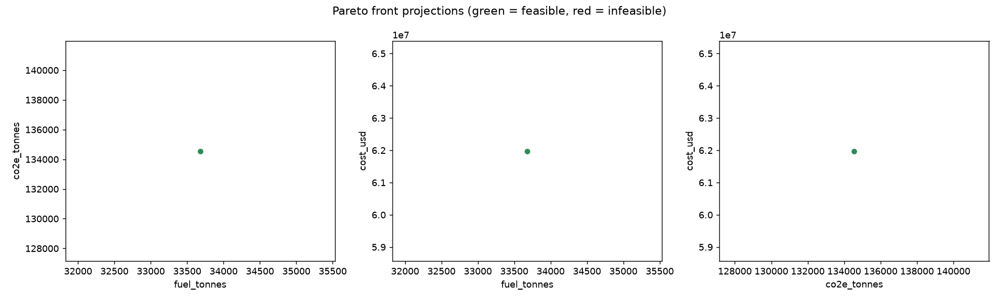
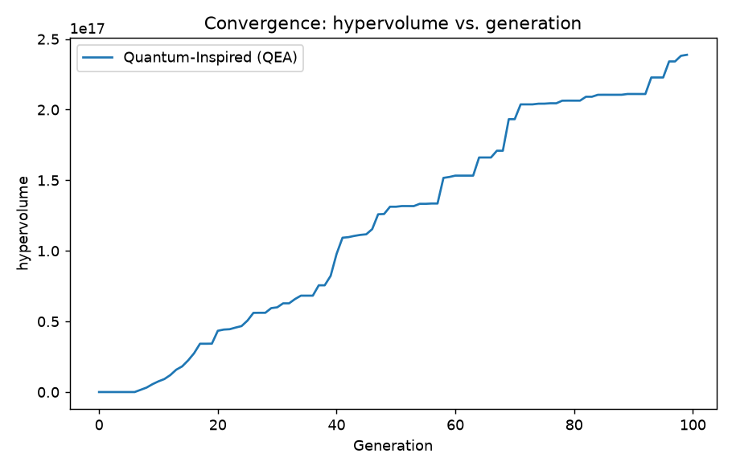
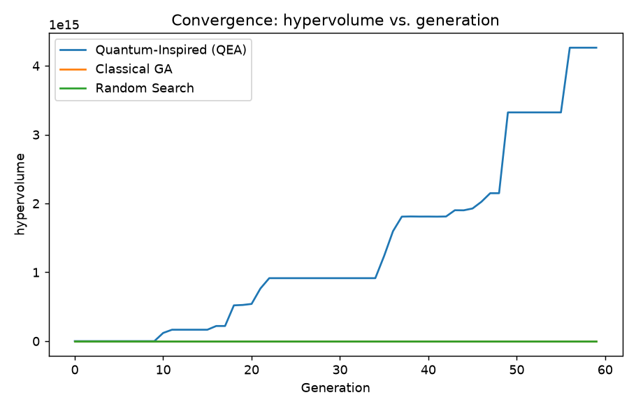
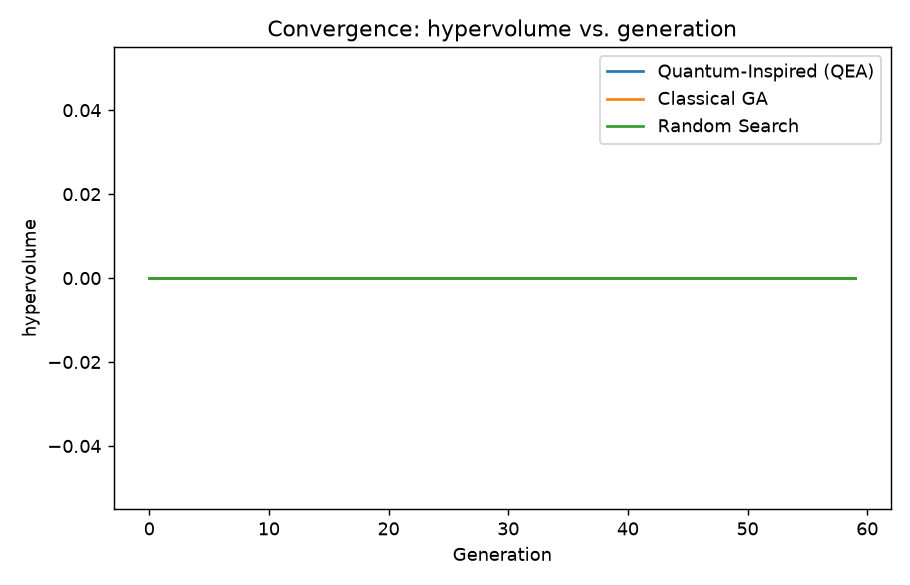

# SIH26138 Demonstration: 50-Route Case Study

Scenario: **demo_case_study** -- 50 routes, carbon price $50/t CO2e, grey alt-fuel pathway.

## Optimization summary

- Pareto archive: **1** non-dominated plans, **1** fully feasible.
- Final hypervolume: **238,848,615,476,587,904.0**

## Recommended plan (lowest cost among feasible solutions)

- Fuel: **33,678.7 t**
- Lifecycle CO2e: **134,553.4 t**
- Total cost: **$61,976,413**
- Constraint violation: **0.0000**

### Fleet allocation

| route_id | vessel_class | fuel_type | speed_knots | shore_power | count | fuel_tonnes | co2e_tonnes | cost_usd |
| --- | --- | --- | --- | --- | --- | --- | --- | --- |
| LONGHAUL_000 | BULK_LARGE | HFO | 10.0 | True | 1 | 916.9 | 3385.9 | 1108119.1 |
| LONGHAUL_001 | BULK_LARGE | HFO | 10.0 | False | 1 | 900.3 | 3313.0 | 1095154.7 |
| LONGHAUL_002 | TANKER_LARGE | LNG | 12.0 | False | 1 | 1361.5 | 5337.1 | 1484982.3 |
| LONGHAUL_002 | GENERAL_CARGO_SMALL | HFO | 10.0 | False | 2 | 233.0 | 857.5 | 488154.6 |
| LONGHAUL_002 | BULK_SMALL | HFO | 10.0 | False | 1 | 241.6 | 889.1 | 312877.5 |
| LONGHAUL_003 | BULK_LARGE | HFO | 10.0 | True | 2 | 1844.1 | 6806.5 | 2220864.3 |
| LONGHAUL_003 | GENERAL_CARGO_SMALL | HFO | 16.0 | True | 1 | 464.5 | 1712.7 | 436537.0 |
| LONGHAUL_004 | BULK_LARGE | HFO | 10.0 | False | 2 | 1848.5 | 6802.5 | 2216680.0 |
| LONGHAUL_005 | BULK_LARGE | HFO | 10.0 | True | 2 | 1830.6 | 6761.1 | 2214831.4 |
| LONGHAUL_006 | BULK_LARGE | HFO | 10.0 | True | 2 | 1840.0 | 6792.5 | 2219008.7 |
| LONGHAUL_007 | BULK_LARGE | LNG | 10.0 | False | 1 | 718.6 | 2816.9 | 1067084.9 |
| LONGHAUL_008 | BULK_LARGE | LNG | 10.0 | True | 1 | 714.3 | 2819.1 | 1070513.3 |
| LONGHAUL_009 | GENERAL_CARGO_LARGE | HFO | 10.0 | False | 1 | 312.1 | 1148.5 | 771656.8 |
| LONGHAUL_009 | BULK_LARGE | LNG | 12.0 | False | 2 | 2524.7 | 9896.9 | 2841072.9 |
| LONGHAUL_010 | BULK_LARGE | LNG | 12.0 | False | 2 | 2538.4 | 9950.4 | 2849944.0 |
| LONGHAUL_011 | BULK_LARGE | HFO | 10.0 | False | 2 | 1850.2 | 6808.8 | 2217615.3 |
| LONGHAUL_011 | TANKER_SMALL | HFO | 10.0 | False | 1 | 292.2 | 1075.2 | 340692.2 |
| LONGHAUL_012 | GENERAL_CARGO_LARGE | HFO | 10.0 | True | 7 | 2161.3 | 8028.9 | 5413361.0 |
| LONGHAUL_012 | BULK_LARGE | MDO | 12.0 | False | 1 | 1482.6 | 5887.5 | 1711942.5 |
| LONGHAUL_013 | BULK_LARGE | LNG | 10.0 | False | 1 | 732.5 | 2871.5 | 1076140.8 |
| LONGHAUL_014 | TANKER_LARGE | MDO | 12.0 | False | 1 | 1546.9 | 6143.0 | 1760201.1 |
| REGIONAL_015 | GENERAL_CARGO_MEDIUM | HFO | 10.0 | False | 1 | 186.1 | 684.9 | 462358.4 |
| REGIONAL_016 | GENERAL_CARGO_LARGE | HFO | 10.0 | True | 1 | 279.9 | 1067.5 | 766219.9 |
| REGIONAL_017 | GENERAL_CARGO_MEDIUM | LNG | 10.0 | False | 1 | 147.3 | 577.2 | 455715.2 |
| REGIONAL_018 | BULK_MEDIUM | LNG | 10.0 | False | 1 | 379.6 | 1487.9 | 606721.7 |
| REGIONAL_019 | GENERAL_CARGO_MEDIUM | HFO | 10.0 | False | 2 | 386.0 | 1420.6 | 932313.4 |
| REGIONAL_020 | BULK_MEDIUM | HFO | 10.0 | True | 1 | 463.5 | 1725.5 | 621435.4 |
| REGIONAL_021 | GENERAL_CARGO_LARGE | MDO | 10.0 | True | 1 | 259.7 | 1071.2 | 807849.1 |
| REGIONAL_022 | BULK_MEDIUM | LNG | 10.0 | False | 1 | 374.5 | 1467.9 | 603394.8 |
| REGIONAL_023 | GENERAL_CARGO_LARGE | HFO | 10.0 | True | 1 | 277.1 | 1059.8 | 765531.2 |
| REGIONAL_024 | GENERAL_CARGO_LARGE | LNG | 12.0 | True | 1 | 370.6 | 1500.9 | 856670.6 |
| REGIONAL_025 | GENERAL_CARGO_LARGE | LNG | 12.0 | False | 1 | 388.8 | 1524.2 | 852740.7 |
| REGIONAL_026 | GENERAL_CARGO_LARGE | HFO | 10.0 | False | 1 | 290.9 | 1070.4 | 759982.2 |
| REGIONAL_027 | GENERAL_CARGO_LARGE | HFO | 10.0 | False | 1 | 298.8 | 1099.7 | 764361.4 |
| REGIONAL_028 | BULK_MEDIUM | LNG | 10.0 | False | 1 | 363.7 | 1425.7 | 596403.4 |
| REGIONAL_029 | BULK_MEDIUM | HFO | 10.0 | False | 1 | 456.4 | 1679.7 | 611040.8 |
| REGIONAL_030 | GENERAL_CARGO_MEDIUM | LNG | 10.0 | False | 5 | 782.2 | 3066.1 | 2308402.9 |
| REGIONAL_031 | GENERAL_CARGO_MEDIUM | LNG | 12.0 | True | 1 | 231.4 | 939.3 | 520964.7 |
| REGIONAL_032 | GENERAL_CARGO_LARGE | HFO | 10.0 | False | 1 | 277.3 | 1020.6 | 752530.7 |
| REGIONAL_033 | TANKER_SMALL | HFO | 10.0 | True | 1 | 227.0 | 850.0 | 309663.3 |
| REGIONAL_034 | GENERAL_CARGO_LARGE | LNG | 10.0 | True | 1 | 232.6 | 939.2 | 760112.7 |
| SHORTSEA_035 | BULK_SMALL | HYDROGEN | 10.0 | False | 1 | 59.1 | 780.3 | 386891.6 |
| SHORTSEA_036 | RORO_SMALL | HYDROGEN | 14.0 | False | 1 | 70.3 | 927.3 | 425878.9 |
| SHORTSEA_037 | GENERAL_CARGO_SMALL | HYDROGEN | 10.0 | False | 1 | 24.5 | 324.1 | 265923.6 |
| SHORTSEA_038 | GENERAL_CARGO_SMALL | HYDROGEN | 10.0 | False | 1 | 26.1 | 344.0 | 271218.3 |
| SHORTSEA_039 | GENERAL_CARGO_SMALL | HYDROGEN | 12.0 | True | 1 | 41.6 | 574.3 | 333843.0 |
| SHORTSEA_040 | BULK_SMALL | HYDROGEN | 10.0 | True | 1 | 63.2 | 850.0 | 406372.7 |
| SHORTSEA_041 | GENERAL_CARGO_SMALL | HYDROGEN | 10.0 | True | 2 | 55.6 | 773.4 | 567521.7 |
| SHORTSEA_042 | BULK_SMALL | HYDROGEN | 10.0 | True | 1 | 51.1 | 699.0 | 366851.7 |
| SHORTSEA_043 | BULK_SMALL | HYDROGEN | 10.0 | True | 1 | 36.5 | 516.8 | 319155.7 |
| SHORTSEA_044 | GENERAL_CARGO_SMALL | HYDROGEN | 12.0 | False | 1 | 34.1 | 450.1 | 299344.1 |
| SHORTSEA_045 | BULK_SMALL | HYDROGEN | 10.0 | False | 1 | 61.0 | 805.2 | 393504.7 |
| SHORTSEA_046 | GENERAL_CARGO_SMALL | HYDROGEN | 10.0 | False | 1 | 15.2 | 200.2 | 233072.3 |
| SHORTSEA_047 | RORO_SMALL | HYDROGEN | 14.0 | True | 1 | 29.1 | 428.7 | 296413.6 |
| SHORTSEA_048 | BULK_SMALL | HYDROGEN | 10.0 | False | 1 | 40.6 | 536.4 | 322229.9 |
| SHORTSEA_049 | GENERAL_CARGO_SMALL | HYDROGEN | 12.0 | False | 1 | 42.5 | 560.7 | 328676.7 |

## Benchmarking: quantum-inspired vs. classical baselines

### 10 routes

| algorithm | runtime_sec | final_hypervolume | generations_to_95pct_hv | archive_size | feasible_count |
| --- | --- | --- | --- | --- | --- |
| Quantum-Inspired (QEA) | 17.5 | 4262810054524828.0 | 56.0 | 4 | 4 |
| Classical GA | 0.8 | 0.0 | nan | 1 | 0 |
| Random Search | 3.0 | 0.0 | nan | 1 | 0 |
| Greedy Heuristic | 0.1 | nan | nan | 1 | 1 |

### 25 routes

| algorithm | runtime_sec | final_hypervolume | generations_to_95pct_hv | archive_size | feasible_count |
| --- | --- | --- | --- | --- | --- |
| Quantum-Inspired (QEA) | 42.6 | 0.0 | nan | 12 | 0 |
| Classical GA | 2.1 | 0.0 | nan | 1 | 0 |
| Random Search | 7.5 | 0.0 | nan | 1 | 0 |
| Greedy Heuristic | 0.1 | nan | nan | 1 | 1 |

